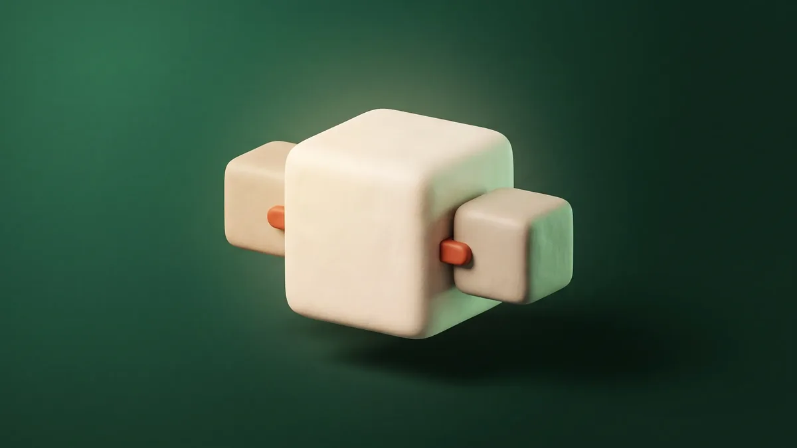

  

# Product Addons for Shop

Offer real products as add-ons on another product's page - a pedestal beside a
desk, a headrest on a chair, a power module under a bench. The add-on stays a
proper product: its own price, its own stock, its own shipping, its own order
line. Nothing is duplicated and nothing is faked.

- **Table prefix:** `pad_`
- **Depends on:** the `shop` module (`>= 0.1.247`) and `shop-variations` (`>= 0.1.128`)

## How it works

1. On **Shop → Products → Product add-ons**, attach one or more products to a
   parent product.
2. Options can be **matched** to the parent's, so choosing Oak on the desk
   chooses Oak on the pedestal without asking twice, or left free for the
   shopper to pick.
3. Add-ons can be shown conditionally, so an accessory only appears when the
   choice it belongs to is actually on the menu.
4. In the basket the add-on lines sit grouped under the product they were bought
   with, and each keeps its own price and shipping through to the order.

## Page builder blocks

| Block | What it does |
|-------|--------------|
| `ShopProductAddons` | The add-on picker, for a product page. |
| `ShopAddonsShowcase` | A display of a product's add-ons, for placing anywhere. |

Part of [Cactus](https://github.com/usersaynoso/cactus-foundation). Install it
from **Modules → Browse** in the admin.
